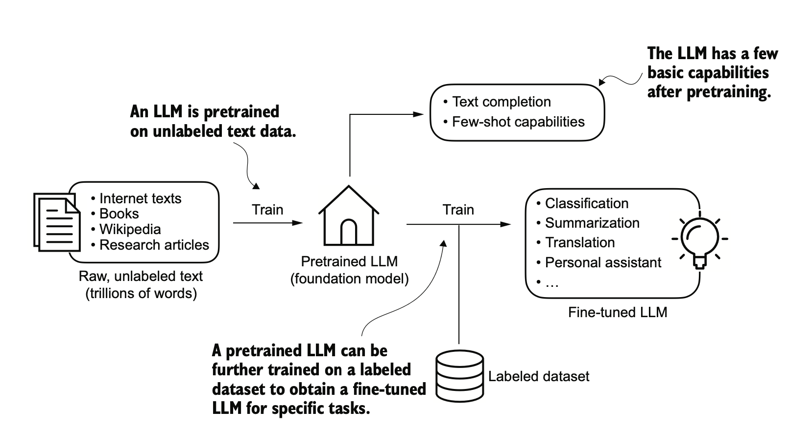

## LLM 101

Presentation about **Large Language Models** from a non-AI developer

  <a href="https://github.com/1995parham-teaching/llm101" target="_blank" alt="GitHub" title="Open in GitHub"
    class="text-xl slidev-icon-btn opacity-50 !border-none !hover:text-white">
    <carbon-logo-github />
  </a>

---

<Toc />

---

# Introduction

An LLM is a neural network designed to understand, generate, and respond to human-like text. These models are deep
neural networks trained on massive amounts of text data, sometimes encompassing large portions of the entire publicly
available text on the internet.

The "large" in "large language model" refers to both the **model's size** in terms of parameters and the **immense dataset**
on which it's trained.

---

LLMs utilize an architecture called the _transformers_; which allows them to pay selective attention to different parts
of the input when making predictions, making them especially adept at handling the nuances and complexities of human
language.

Since LLMs are capable of _generating_ text, LLMs are also often referred to as a form of generative artificial
intelligence, often abbreviated as **generative AI** or **GenAI**.

---

# Why we should build our own LLMs?

Research has shown that when it comes to modeling performance, custom-built LLMs (those are tailored for specific tasks or
domains) can outperform general-purpose LLMs.

---

LLM is trained on a large, diverse dataset to develop a board understanding of language. This pre-trained model then
serve as a foundational resource that can be further refined through fine-tuning, a process the model is specially
trained on a narrower dataset that is more specific to particular tasks or domains.

---

# What is Ollama?

[Ollama](https://ollama.com/) stands for (Omni-Layer Learning Language Acquisition Model), a novel approach to machine learning
that promises to redefine how we perceive language acquisition and natural language processing. At its core,
Ollama is a groundbreaking platform that **democratizes access to large language models (LLMs)
by enabling users to run them locally on their machines**.

---

## Key Features of Ollama

- **Local Execution**: One of the distinguishing features of Ollama is its ability to _run LLMs locally_,
  mitigating privacy concerns associated with cloud-based solutions.
- **Extensive Model Library**: Ollama offers access to an extensive library of _pre-trained LLMs_,
  including popular models like Llama 3.
- **Seamless Integration**: Ollama seamlessly integrates with a variety of tools, frameworks, and programming languages,
  making it easy for developers to incorporate LLMs into their workflows.
  Whether it's Python, LangChain, or LlamaIndex, Ollama provides robust integration options for building sophisticated
  AI applications and solutions.
- **Customization and Fine-tuning**: With Ollama, users have the ability to _customize_ and _fine-tune_ LLMs to suit their
  specific needs and preferences. From prompt engineering to few-shot learning and fine-tuning processes,
  Ollama empowers users to shape the behavior and outputs of LLMs, ensuring they align with the desired objectives.
