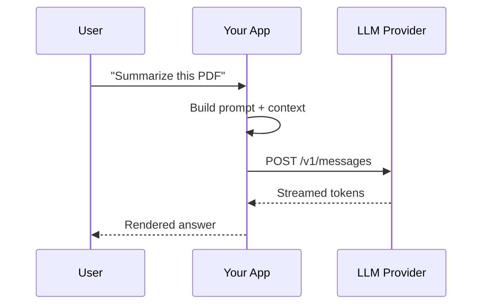

# LLM 101

An introduction to **Large Language Models** from a non-AI developer.

<div class="abs-br m-6 flex">
  <a href="https://github.com/1995parham-teaching/llm101" target="_blank" alt="GitHub" title="Open in GitHub"
    class="text-xl slidev-icon-btn opacity-50 !border-none !hover:text-white">
    <carbon-logo-github />
  </a>
</div>

<!--
Welcome. The goal of this talk is to give you a working mental model of LLMs
without any math. By the end you should know what tokens are, what the
transformer is doing at a high level, and how to choose between prompting,
RAG, and fine-tuning for a real problem.
-->

---
hideInToc: true
---

# Agenda

<Toc minDepth="1" maxDepth="1" />

---

# What is an LLM?

An LLM is a neural network trained to **predict the next token** in a sequence.
That is — almost — the entire trick.

<v-clicks>

- Trained on enormous text corpora (much of the public web, books, code).
- The "large" refers to both the **parameter count** (billions to trillions) and
  the **dataset size**.
- Because they generate text, LLMs are a form of **generative AI** (GenAI).

</v-clicks>

<!--
Stress that "predict the next token" sounds reductive but is literally the
training objective. Everything else — chat, reasoning, tool use — emerges
from scaling that one objective plus some post-training tricks.
-->

---

# Tokens, not words

LLMs do not see characters or words. They see **tokens** — sub-word chunks
produced by a tokenizer.

<v-clicks>

- `"tokenization"` → `["token", "ization"]` (2 tokens)
- `"hello world"` → ~2 tokens; a paragraph of English ≈ 75 words ≈ 100 tokens.
- **Context window** = max tokens the model can see at once (4k → 1M+ today).
- **You pay per token**, in _and_ out. Long prompts get expensive fast.

</v-clicks>

<!--
Mental rule of thumb: 1 token ≈ 4 characters of English ≈ 0.75 words.
Code, JSON, and non-English languages use more tokens per word.
Try OpenAI's tokenizer or `tiktoken` to build intuition.
-->

---

# The transformer, in one slide

LLMs are built on the **transformer** architecture (Vaswani et al., 2017).

<v-clicks>

- Each layer has an **attention** mechanism: every token can "look at" every
  other token in the context and decide what is relevant.
- Stack ~tens of these layers and you get a model that captures long-range
  dependencies — pronouns to their referents, code to its imports, questions
  to their answers.
- Training is just: show it text, ask it to predict the next token, nudge the
  weights when it's wrong. Repeat for trillions of tokens.

</v-clicks>

<!--
The "Attention Is All You Need" paper is the canonical reference. You don't
need to read it to use LLMs, but it's surprisingly accessible.
-->

---

# Why train your own?

Research shows that **task-specific** LLMs can outperform general-purpose ones
on their target domain — at a fraction of the size.

<div class="grid grid-cols-2 gap-6 mt-6">

<div v-click>

**Foundation model**

Trained once, on a broad and diverse corpus. Develops a general understanding
of language, code, and the world.

</div>

<div v-click>

**Fine-tuned model**

The foundation model is further trained on a narrow dataset specific to your
task or domain (legal, medical, your codebase).

</div>

</div>


---

# Prompt vs RAG vs fine-tune

The most common question: _which one do I reach for?_

| Technique       | Good for                               | Cost     |
| --------------- | -------------------------------------- | -------- |
| **Prompting**   | Behaviour, style, format               | Cheapest |
| **Few-shot**    | Showing the model a pattern by example | Cheap    |
| **RAG**         | Injecting _fresh_ or _private_ facts   | Medium   |
| **Fine-tuning** | New skills, tone, structured output    | Highest  |

<v-click>

Rule of thumb: **try prompting first, then RAG, then fine-tuning.** Most
problems that look like "the model doesn't know X" are actually RAG problems,
not fine-tuning problems.

</v-click>

<!--
Fine-tuning is rarely the right first move. It's expensive, freezes a snapshot
of knowledge, and is hard to update. RAG keeps your knowledge base mutable.
-->

---

# Prompt engineering basics

<v-clicks>

- **System message**: who the model _is_ and the rules it must follow.
- **User message**: what you actually want for this turn.
- **Few-shot examples**: show 2–5 input/output pairs in the prompt.
- **Structured output**: ask for JSON (or use the API's JSON / schema mode) so
  your code can parse the response reliably.
- **Be specific** about format, length, audience, and edge cases. The model
  cannot read your mind.

</v-clicks>

---

# Tool calling and agents

Modern LLMs can do more than answer — they can **call functions you expose**.

<v-clicks>

1. You describe your tools (name, description, JSON schema for arguments).
2. The model decides _if_ and _which_ tool to call, and produces arguments.
3. **Your code** executes the tool and returns the result.
4. The model continues the conversation with that result.

An **agent** is just this loop running until the model says "I'm done."

</v-clicks>

<!--
This is the dominant production pattern in 2025–2026. Search, databases,
file systems, browser automation — they all plug in as tools. The model
becomes a planner; your code is still in charge of side effects.
-->

---

# What is Ollama?

[Ollama](https://ollama.com/) is an open-source tool that lets you **run LLMs
locally** on your own machine — laptop, workstation, or server.

<v-clicks>

- One-line install of open models (Llama, Mistral, Qwen, Gemma, Phi, …).
- Ships an **OpenAI-compatible HTTP API** on `localhost:11434`.
- No data leaves your machine — useful for privacy-sensitive work.
- Trade-off: you are limited by your own GPU / RAM.

</v-clicks>

---

## Ollama in 30 seconds

```sh
# install (macOS / Linux)
curl -fsSL https://ollama.com/install.sh | sh

# pull and run a model
ollama run llama3.2

# or call it from code via the HTTP API
curl http://localhost:11434/api/generate -d '{
  "model": "llama3.2",
  "prompt": "Explain transformers in one sentence."
}'
```

<v-click>

It's the same shape as the OpenAI API, so most client libraries work by just
swapping the base URL.

</v-click>

---

# LLM as a service

Most teams don't self-host. They call a hosted API from a provider that runs
the model for them.


```mermaid {scale: 0.8}
sequenceDiagram
  participant U as User
  participant A as Your App
  participant P as LLM Provider
  U->>A: "Summarize this PDF"
  A->>A: Build prompt + context
  A->>P: POST /v1/messages
  P-->>A: Streamed tokens
  A-->>U: Rendered answer
```

<!--
Note that "your app" is doing most of the interesting work: assembling the
prompt, retrieving context, parsing the response, calling tools. The model
is a smart but stateless function call.
-->

---

# Local vs hosted: trade-offs

<div class="grid grid-cols-2 gap-6">

<div>

### Local (Ollama, llama.cpp)

- Private by construction
- No per-token cost
- Works offline
- Limited by your hardware
- Smaller / older open models
- You operate the stack

</div>

<div>

### Hosted (OpenAI, Anthropic, …)

- Frontier-quality models
- No infra to run
- Pay per token, in and out
- Data leaves your network
- Rate limits, outages
- Vendor lock-in risk

</div>

</div>

---

# Limitations to keep in mind

<v-clicks>

- **Hallucinations** — confident, fluent, and wrong. Always verify factual
  claims, especially names, numbers, citations, and APIs.
- **Knowledge cutoff** — the model doesn't know about events after its
  training data ends. Use RAG or tools for fresh information.
- **Context window** — long conversations get truncated; important
  instructions can fall off the top.
- **Prompt injection** — untrusted text in the prompt (web pages, emails,
  PDFs) can override your instructions. Treat model output as untrusted input.
- **Non-determinism** — same prompt, different answer. Set `temperature: 0`
  for reproducible results, but expect some drift.

</v-clicks>

---
layout: center
class: text-center
---

# Thanks!

Questions?

[github.com/1995parham-teaching/llm101](https://github.com/1995parham-teaching/llm101)
